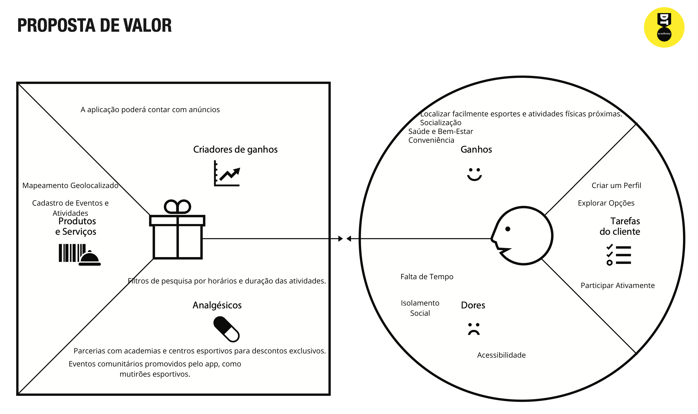
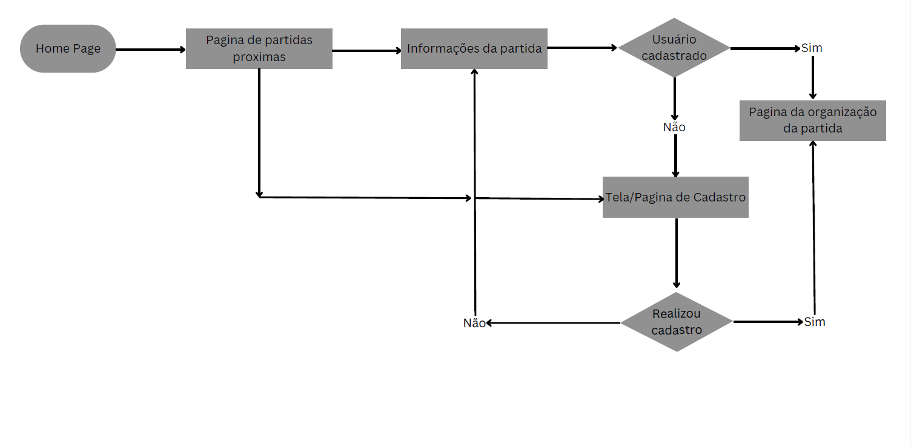
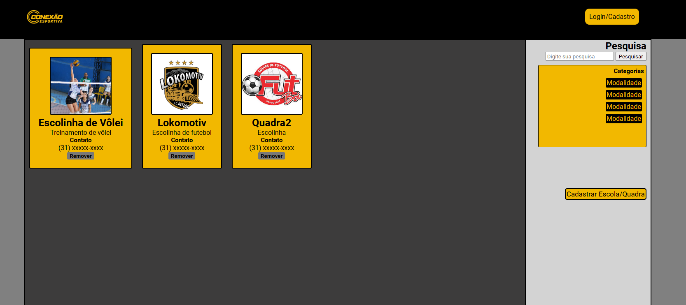

<h2>História de usuários</h2> 

| EU COMO...`PERSONA` | QUERO/PRECISO ...`FUNCIONALIDADE`        | PARA ...`MOTIVO/VALOR`               |
| --------------------- | ------------------------------------------ | -------------------------------------- |
| Universitário 25 anos  | Iniciar novas atividades esportivas      | Ter um estilo de vida mais saudável   |
| Senhor aposentado     |Encontrar espaços adaptados a idosos     |Ter mais disposição na terceira idade  |
| Jovem gamer     |Localizar uma academia com horários flexíveis     |Encaixe na rotina  |
| Estudante sem opções dentro da escola   |Buscar uma turma que pratique meu esporte|Possa evoluir dentro da modalidade|
| Trabalhador home office|Encontrar aulas de Yoga|Cuidados com o próprio corpo  |
 
<h2>Proposta de valor</h2> 
 
<h2>Requisitos funcionais e não funcionais</h2> 

| ID     | Descrição do Requisito                                   | Prioridade |
| ------ | ---------------------------------------------------------- | ---------- |
| RF-001 |Cadastro de usuários |Média       |
| RF-002 | Gerenciamento de eventos |Alta     |
| RF-003 | Pesquisa e Filtros |Alta     |

### Requisitos não Funcionais

| ID      | Descrição do Requisito                                                              | Prioridade |
| ------- | ------------------------------------------------------------------------------------- | ---------- |
| RNF-001 | O app deve carregar resultados de busca em menos de 3 segundos | MÉDIA     |
| RNF-002 | Disponibilidade do app para iOS, Android e versão web    | BAIXA      |

 
<h2>Wireframe</h2> 
 
 

